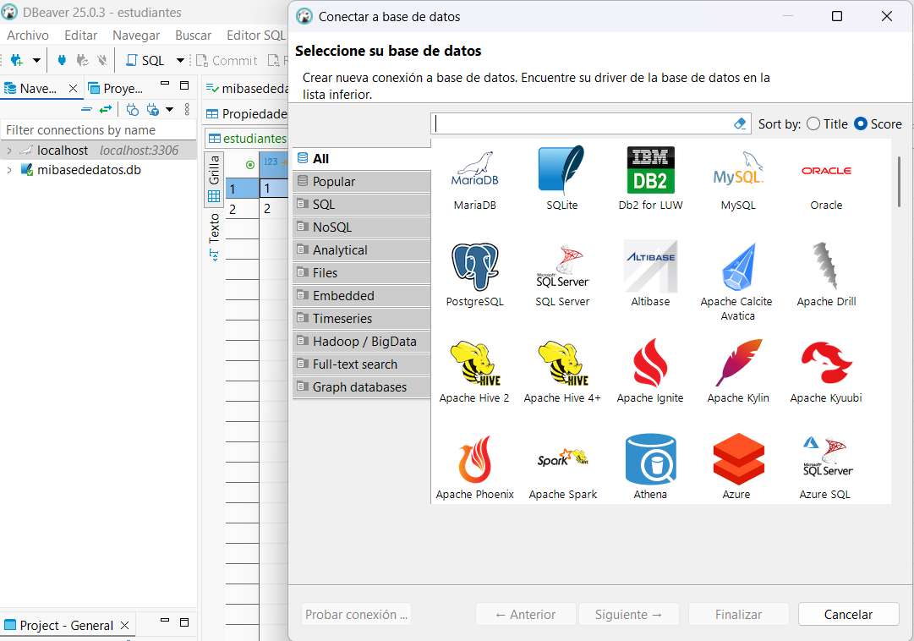

# Proyecto UF1470 - Administración de Sistemas Gestores de Bases de Datos

**Autor:** Juan de la Morena  
**Cliente de base de datos:** DBeaver  
**Entorno:** Windows 10  
**Bases de datos:** MySQL y SQLite  
**Repositorio:** [GitHub](https://github.com/tuusuario/tu-repo) *(actualiza este enlace)*

---

## 🌟 Objetivo del Proyecto

Este trabajo forma parte del módulo UF1470 y tiene como objetivo evaluar la comprensión y aplicación práctica en la administración de sistemas gestores de bases de datos (SGBD).

Asumes el rol de **DBA (Administrador de Base de Datos)** de la empresa ficticia "DataSolutions S.A.", y debes encargarte de:

- Crear y administrar bases de datos con MySQL y SQLite
- Configurar usuarios y permisos
- Insertar y validar datos
- Automatizar tareas de respaldo
- Implementar medidas de seguridad y auditoría
- Optimizar el rendimiento de las consultas

---

## 📂 Estructura del Repositorio

```
UF1470_Juan_delaMorena/
│
├── scripts/
│   ├── mysql/              # Scripts SQL para tareas con MySQL
│   └── sqlite/             # Scripts SQL para tareas con SQLite
│
├── tareas_programadas/     # Script de copia de seguridad en Windows
│
├── docs/
│   ├── capturas_dbeaver/   # Evidencias visuales paso a paso
│   └── informe_final.pdf   # Documento completo del proyecto
│
└── README.md               # Este documento
```

---

## 🔧 Preparación del Entorno

1. **Instalar MySQL:** [https://dev.mysql.com/downloads/mysql/](https://dev.mysql.com/downloads/mysql/)
2. **Instalar SQLite3:** [https://www.sqlite.org/download.html](https://www.sqlite.org/download.html)
3. **Instalar DBeaver:** [https://dbeaver.io/](https://dbeaver.io/)
4. **Instalar VSCode:** [https://code.visualstudio.com/](https://code.visualstudio.com/)
5. **Extensión Markdown PDF para VSCode** (para convertir este archivo a PDF)

---

## 📃 Parte 1: MySQL - Configuración y Administración

### 1. Crear la base de datos
```sql
CREATE DATABASE DataSolutionsDB;
```
> *Explicación:* Esto crea una base de datos vacía en el servidor MySQL donde se almacenará la información.

### 2. Crear usuarios y asignar permisos
```sql
CREATE USER 'consultor'@'localhost' IDENTIFIED BY 'TuContraseña123';
GRANT SELECT ON DataSolutionsDB.* TO 'consultor'@'localhost';

CREATE USER 'admin_ventas'@'localhost' IDENTIFIED BY 'TuContraseña123';
GRANT SELECT, INSERT, UPDATE ON DataSolutionsDB.clientes TO 'admin_ventas'@'localhost';
```
> *Explicación:* Se crean dos usuarios. Uno con permisos de solo lectura y otro con permisos para insertar y actualizar en la tabla `clientes`.

### 3. Optimizar una consulta
```sql
CREATE INDEX idx_ciudad_fecha ON clientes(ciudad, fecha_registro);
```
> *Explicación:* Se crea un índice sobre las columnas utilizadas en los filtros para acelerar la búsqueda.

### 4. Finalizar consultas pesadas
```sql
SHOW PROCESSLIST;
KILL <ID_DEL_PROCESO>;
```
> *Explicación:* Con estos comandos se visualizan y finalizan procesos activos que estén bloqueando el servidor.

---

## 📃 Parte 2: SQLite - Creación e Inserción

### 1. Crear base de datos y tabla
```sql
CREATE TABLE clientes (
    id INTEGER PRIMARY KEY,
    nombre TEXT,
    apellido TEXT,
    ciudad TEXT,
    fecha_registro DATE
);
```

### 2. Insertar datos de ejemplo
```sql
INSERT INTO clientes (nombre, apellido, ciudad, fecha_registro) VALUES
('Juan', 'Pérez', 'Madrid', '2024-02-15'),
('Ana', 'López', 'Barcelona', '2023-11-03'),
('Luis', 'Martínez', 'Sevilla', '2024-01-21'),
('Clara', 'Ramírez', 'Valencia', '2022-09-12'),
('Mario', 'Gómez', 'Madrid', '2024-03-01');
```

> *Explicación:* Creamos una tabla en SQLite con campos básicos y algunos registros ficticios.

---

## 🔒 Parte 3: Automatización y Seguridad

### 1. Copia de seguridad en MySQL
```sql
CREATE TABLE clientes_backup AS SELECT * FROM clientes;
```

### 2. Procedimiento para validar datos
```sql
DELIMITER //
CREATE PROCEDURE insertar_cliente (
    IN p_nombre VARCHAR(50),
    IN p_apellido VARCHAR(50),
    IN p_ciudad VARCHAR(50),
    IN p_fecha DATE
)
BEGIN
    IF p_fecha > CURDATE() THEN
        SIGNAL SQLSTATE '45000'
        SET MESSAGE_TEXT = 'La fecha de registro no puede ser futura.';
    ELSE
        INSERT INTO clientes (nombre, apellido, ciudad, fecha_registro)
        VALUES (p_nombre, p_apellido, p_ciudad, p_fecha);
    END IF;
END //
DELIMITER ;
```

### 3. Trigger de auditoría en SQLite
```sql
CREATE TABLE log_clientes (
    fecha_modificacion TEXT,
    usuario TEXT,
    operacion TEXT,
    datos_antiguos TEXT,
    datos_nuevos TEXT
);

CREATE TRIGGER trigger_log_update
AFTER UPDATE ON clientes
BEGIN
    INSERT INTO log_clientes (
        fecha_modificacion, usuario, operacion, datos_antiguos, datos_nuevos
    )
    VALUES (
        datetime('now'),
        'usuario_windows',
        'UPDATE',
        json_object('id', OLD.id, 'nombre', OLD.nombre, 'apellido', OLD.apellido, 'ciudad', OLD.ciudad, 'fecha_registro', OLD.fecha_registro),
        json_object('id', NEW.id, NEW.nombre, NEW.apellido, NEW.ciudad, NEW.fecha_registro)
    );
END;
```

---

## 🚀 Parte 4: Automatización de Tareas

### Script .bat para copias de seguridad
```bat
@echo off
set FECHA=%DATE:~6,4%-%DATE:~3,2%-%DATE:~0,2%
mysqldump -u root -pTuContraseña DataSolutionsDB > "C:\\backups\\DataSolutionsDB_%FECHA%.sql"
```

### Planificación con Programador de Tareas de Windows
1. Abre el Programador de Tareas.
2. Crea una nueva tarea.
3. Configura la ejecución diaria del script `.bat` anterior.

---

## 📈 Parte 5: Monitoreo del Rendimiento

Herramientas sugeridas:
- DBeaver (consultas y monitoreo en vivo)
- MySQL Workbench (para entornos avanzados)
- `SHOW STATUS`, `SHOW PROCESSLIST` para analizar cuellos de botella

---

## 📷 Capturas de Pantalla (Evidencias)

Inserta en la carpeta `/docs/capturas_dbeaver/` y enlaza aquí:

1. [ ] Creación de base de datos y usuarios en MySQL  
2. [ ] Ejecución de consultas en SQLite  
3. [ ] Verificación de procedimiento almacenado  
4. [ ] Disparador y log de auditoría  
5. [ ] Script de copia en acción  

Puedes incluirlas con sintaxis Markdown:
```markdown

```

---

## 🎓 Conclusiones

Este proyecto me permitió:
- Aplicar de forma práctica los conceptos de administración de bases de datos
- Automatizar tareas clave como backups y validación de integridad
- Documentar y presentar un proyecto técnico en GitHub de forma profesional

> *Lo que mejoraría:* usar contenedores (como Docker) para pruebas automatizadas y monitoreo avanzado.

---

## 💡 Recomendaciones Finales

- Utiliza comentarios explicativos en todos tus scripts SQL.
- Guarda tus scripts y capturas en GitHub para que el repositorio sea autoexplicativo.
- Convierte este archivo a PDF con la extensión `Markdown PDF` para tener una entrega formal.

