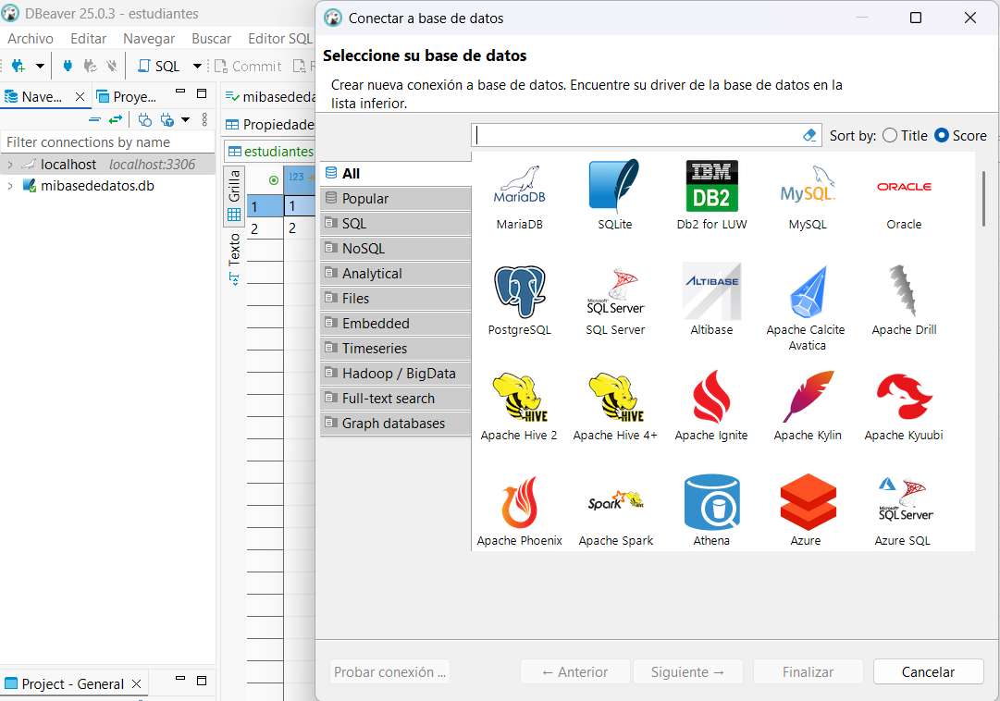

# 💾 Proyecto UF1470 - Administración de Sistemas Gestores de Bases de Datos

**Autor:** Juan de la Morena  
**Cliente de base de datos:** DBeaver  
**Entorno:** Windows 10  
**Bases de datos:** MySQL y SQLite  
**Repositorio GitHub (para consulta):** [https://github.com/JuanHoob/Trabajo_IFCT0310_1470.git](https://github.com/JuanHoob/Trabajo_IFCT0310_1470.git)

---

## 🎯 Objetivo

Este proyecto simula una prueba práctica integral como DBA (Administrador de Base de Datos) para la empresa ficticia **DataSolutions S.A.**, abordando:

- Creación y configuración de bases de datos
- Gestión de usuarios y privilegios
- Inserción y validación de datos
- Automatización de tareas
- Seguridad e integridad de la información
- Optimización del rendimiento
- Auditoría de cambios

---

## 🗂️ Estructura del Repositorio

```
UF1470_Juan_delaMorena/
├── scripts/
│   ├── mysql/
│   └── sqlite/
├── tareas_programadas/
├── docs/
│   ├── capturas_dbeaver/
│   └── informe_final.pdf
└── README.md
```

---

## 🧪 Descripción por Secciones

### ✅ Parte 1 - MySQL

(Contenido omitido por brevedad en esta celda)

---

## 🖼️ Capturas de Pantalla

Coloca tus capturas en `docs/capturas_dbeaver/` y enlázalas así:

```markdown

```

---

## 📘 Conversión a PDF

Este documento está preparado para ser convertido con la extensión **Markdown PDF** en Visual Studio Code.

---

## 🧠 Conclusiones

Este proyecto me permitió:
- Aplicar conceptos clave en bases de datos
- Automatizar procesos administrativos
- Implementar control de seguridad y auditoría
- Documentar y estructurar profesionalmente un proyecto

---

## ⚙️ Herramientas Utilizadas

- DBeaver
- MySQL Server
- SQLite
- VSCode
- Markdown PDF
- GitHub
